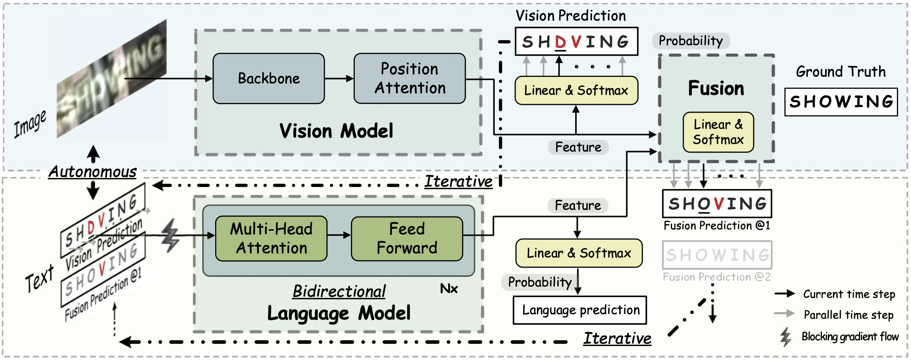
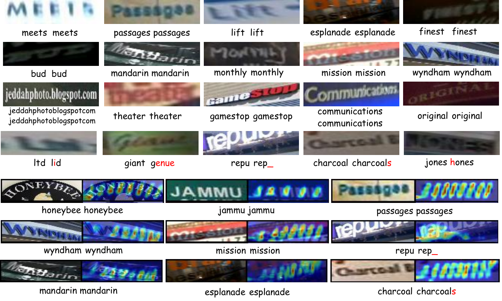

# Read Like Humans: Autonomous, Bidirectional and Iterative Language Modeling for Scene Text Recognition

The official code of [ABINet](https://arxiv.org/pdf/2103.06495.pdf) (CVPR 2021, Oral).

ABINet uses a vision model and an explicit language model to recognize text in the wild, which are trained in end-to-end way. The language model (BCN) achieves bidirectional language representation in simulating cloze test, additionally utilizing iterative correction strategy.



## Runtime Environment

- We provide a pre-built docker image using the Dockerfile from `docker/Dockerfile`

- Running in Docker
    ```
    $ git@github.com:FangShancheng/ABINet.git
    $ docker run --gpus all --rm -ti --ipc=host -v "$(pwd)"/ABINet:/app fangshancheng/fastai:torch1.1 /bin/bash
    ```
- (Untested) Or using the dependencies
    ```
    pip install -r requirements.txt
    ```

## Datasets

- Training datasets

    1. [MJSynth](http://www.robots.ox.ac.uk/~vgg/data/text/) (MJ): 
        - Use `tools/create_lmdb_dataset.py` to convert images into LMDB dataset
        - [LMDB dataset BaiduNetdisk(passwd:n23k)](https://pan.baidu.com/s/1mgnTiyoR8f6Cm655rFI4HQ)
    2. [SynthText](http://www.robots.ox.ac.uk/~vgg/data/scenetext/) (ST):
        - Use `tools/crop_by_word_bb.py` to crop images from original [SynthText](http://www.robots.ox.ac.uk/~vgg/data/scenetext/) dataset, and convert images into LMDB dataset by `tools/create_lmdb_dataset.py`
        - [LMDB dataset BaiduNetdisk(passwd:n23k)](https://pan.baidu.com/s/1mgnTiyoR8f6Cm655rFI4HQ)
    3. [WikiText103](https://s3.amazonaws.com/research.metamind.io/wikitext/wikitext-103-v1.zip), which is only used for pre-trainig language models:
        - Use `notebooks/prepare_wikitext103.ipynb` to convert text into CSV format.
        - [CSV dataset BaiduNetdisk(passwd:dk01)](https://pan.baidu.com/s/1yabtnPYDKqhBb_Ie9PGFXA)

- Evaluation datasets, LMDB datasets can be downloaded from [BaiduNetdisk(passwd:1dbv)](https://pan.baidu.com/s/1RUg3Akwp7n8kZYJ55rU5LQ), [GoogleDrive](https://drive.google.com/file/d/1dTI0ipu14Q1uuK4s4z32DqbqF3dJPdkk/view?usp=sharing).
    1. ICDAR 2013 (IC13)
    2. ICDAR 2015 (IC15)
    3. IIIT5K Words (IIIT)
    4. Street View Text (SVT)
    5. Street View Text-Perspective (SVTP)
    6. CUTE80 (CUTE)


- The structure of `data` directory is
    ```
    data
    ├── charset_36.txt
    ├── evaluation
    │   ├── CUTE80
    │   ├── IC13_857
    │   ├── IC15_1811
    │   ├── IIIT5k_3000
    │   ├── SVT
    │   └── SVTP
    ├── training
    │   ├── MJ
    │   │   ├── MJ_test
    │   │   ├── MJ_train
    │   │   └── MJ_valid
    │   └── ST
    ├── WikiText-103.csv
    └── WikiText-103_eval_d1.csv
    ```

### Pretrained Models

Get the pretrained models from [BaiduNetdisk(passwd:kwck)](https://pan.baidu.com/s/1b3vyvPwvh_75FkPlp87czQ), [GoogleDrive](https://drive.google.com/file/d/1mYM_26qHUom_5NU7iutHneB_KHlLjL5y/view?usp=sharing). Performances of the pretrained models are summaried as follows:

|Model|IC13|SVT|IIIT|IC15|SVTP|CUTE|AVG|
|-|-|-|-|-|-|-|-|
|ABINet-SV|97.1|92.7|95.2|84.0|86.7|88.5|91.4|
|ABINet-LV|97.0|93.4|96.4|85.9|89.5|89.2|92.7|

## Training

1. Pre-train vision model
    ```
    CUDA_VISIBLE_DEVICES=0,1,2,3 python main.py --config=configs/pretrain_vision_model.yaml
    ```
2. Pre-train language model
    ```
    CUDA_VISIBLE_DEVICES=0,1,2,3 python main.py --config=configs/pretrain_language_model.yaml
    ```
3. Train ABINet
    ```
    CUDA_VISIBLE_DEVICES=0,1,2,3 python main.py --config=configs/train_abinet.yaml
    ```
Note:
- You can set the `checkpoint` path for vision and language models separately for specific pretrained model, or set to `None` to train from scratch


## Evaluation

```
CUDA_VISIBLE_DEVICES=0 python main.py --config=configs/train_abinet.yaml --phase test --image_only
```
Additional flags:
- `--checkpoint /path/to/checkpoint` set the path of evaluation model 
- `--test_root /path/to/dataset` set the path of evaluation dataset
- `--model_eval [alignment|vision]` which sub-model to evaluate
- `--image_only` disable dumping visualization of attention masks

## Web Demo

Integrated into [Huggingface Spaces 🤗](https://huggingface.co/spaces) using [Gradio](https://github.com/gradio-app/gradio). Try out the Web Demo: [](https://huggingface.co/spaces/tomofi/ABINet-OCR)

## Run Demo

```
python demo.py --config=configs/train_abinet.yaml --input=figs/test
```
Additional flags:
- `--config /path/to/config` set the path of configuration file 
- `--input /path/to/image-directory` set the path of image directory or wildcard path, e.g, `--input='figs/test/*.png'`
- `--checkpoint /path/to/checkpoint` set the path of trained model
- `--cuda [-1|0|1|2|3...]` set the cuda id, by default -1 is set and stands for cpu
- `--model_eval [alignment|vision]` which sub-model to use
- `--image_only` disable dumping visualization of attention masks

## Visualization
Successful and failure cases on low-quality images:



## Citation
If you find our method useful for your reserach, please cite
```bash 
@article{fang2021read,
  title={Read Like Humans: Autonomous, Bidirectional and Iterative Language Modeling for Scene Text Recognition},
  author={Fang, Shancheng and Xie, Hongtao and Wang, Yuxin and Mao, Zhendong and Zhang, Yongdong},
    booktitle={Proceedings of the IEEE/CVF Conference on Computer Vision and Pattern Recognition},
  year={2021}
}
 ```

 ## License

This project is only free for academic research purposes, licensed under the 2-clause BSD License - see the LICENSE file for details.

Feel free to contact fangsc@ustc.edu.cn if you have any questions.
